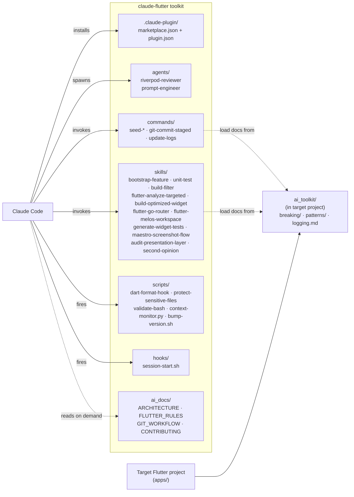

# Architecture

## What this repo is

A collection of Claude Code agents, commands, scripts, and skills for Flutter/Dart projects using Riverpod v3, GoRouter, clean architecture, and Melos monorepo tooling.

This is a **toolkit repo** — the actual Flutter app lives elsewhere (e.g. `apps/tomcat_portal/`, `apps/pollicino_viewer/`). All paths inside commands and skills are relative to the Flutter project root, not this repo.

## Repo structure

| Path | Purpose |
|---|---|
| `agents/` | Custom Claude Code subagent definitions (`.md` with frontmatter) |
| `commands/` | Slash commands — each is a procedure Claude follows when invoked |
| `scripts/` | Hook scripts run by the Claude Code harness (PostToolUse, PreToolUse, etc.) |
| `skills/` | Reusable skill definitions invoked via the `Skill` tool |
| `hooks/` | Session-start hook for context injection |
| `.claude-plugin/` | Claude Code plugin manifest (`marketplace.json`, `plugin.json`) |
| `ai_docs/` | Architecture, rules, and contributor docs (loaded on demand) |

## Module diagram

## Commands

Commands reference **source-of-truth files** in the target Flutter project's `ai_toolkit/` directory. When invoked, they load those files first. The commands themselves are thin dispatchers.

| Command | When to use |
|---|---|
| `seed-context` | Start of any session — loads core breaking/pattern docs |
| `seed-ui-context` | UI-only / layout / widget work |
| `seed-fix-refactor` | Bug fixes, refactors, performance |
| `git-commit-staged` | Generate Conventional Commits message for staged changes |
| `update-logs` | Update a feature's logging to project standards |

## Key skills

| Skill | Trigger |
|---|---|
| `bootstrap-feature` | "Starting a new feature" — Socratic intake, clean-arch scaffold, architecture contract, context seed |
| `build-filter` | After modifying `@riverpod`/`@JsonSerializable` — targeted codegen only |
| `flutter-analyze-targeted` | Fast `dart analyze` scoped to a feature path |
| `unit-test` | Generate/update/repair unit tests (mocktail, GWT, Riverpod ProviderContainer) |
| `generate-widget-tests` | Generate widget tests using Robot Testing pattern |
| `build-optimized-widget` | Create a new Flutter widget with Riverpod `.select()`, Consumer, side-effect patterns |
| `flutter-go-router` | Navigation: routes, guards, shell navigation, URL-driven state |
| `flutter-melos-workspace` | Melos monorepo orchestration |
| `audit-presentation-layer` | Rules-based static audit (Riverpod, Robot Testing, GoRouter, layout) |
| `second-opinion` | Independent architecture review (requires Gemini CLI) |

## Agents

| Agent | Purpose |
|---|---|
| `riverpod-reviewer` | Reviews Riverpod v3 provider code — `ref.watch`/`ref.read` placement, `.select()` usage, v3 naming, `AsyncValue` handling |
| `prompt-engineer` | Designs, tests, and optimizes LLM prompts for production systems |

## Scripts (hooks)

| Script | Hook type | What it does |
|---|---|---|
| `dart-format-hook.sh` | PostToolUse (Edit/Write) | Auto-formats `.dart` files; skips `.g.dart` and `.freezed.dart` |
| `protect-sensitive-files.sh` | PreToolUse | Blocks edits to `.env*`, `google-services.json`, `GoogleService-Info.plist` |
| `validate-bash.sh` | PreToolUse | Blocks Bash commands matching forbidden patterns (build dirs, pubspec.lock, seed data) |
| `context-monitor.py` | StatusLine | Displays model, context %, git branch, cost, and duration in the terminal status line |

## Skill variants: dispatcher vs self-contained

- **Dispatcher skills** (e.g. `build-optimized-widget`): load rules from the target project's `ai_toolkit/` at runtime. Use when rules evolve with the Flutter project.
- **Self-contained skills** (e.g. `audit-presentation-layer`): bundle `rules/` locally. Use when rules are stable or copied from upstream. State this explicitly in SKILL.md to avoid confusion with the dispatcher pattern.
