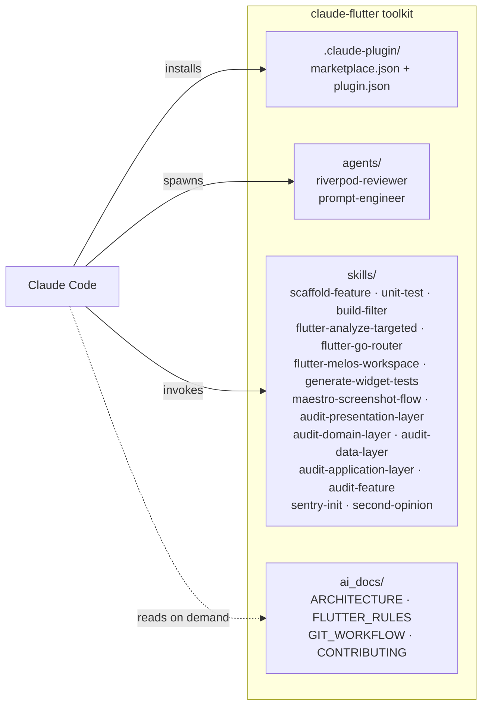

# Architecture

## What this repo is

A collection of Claude Code agents and skills for Flutter/Dart projects using Riverpod v3, GoRouter, clean architecture, and Melos monorepo tooling.

This is a **toolkit repo** — the actual Flutter app lives elsewhere (e.g. `apps/tomcat_portal/`, `apps/pollicino_viewer/`). All paths inside skills are relative to the Flutter project root, not this repo.

## Repo structure

| Path | Purpose |
|---|---|
| `agents/` | Custom Claude Code subagent definitions (`.md` with frontmatter) |
| `skills/` | Reusable skill definitions invoked via the `Skill` tool |
| `.claude-plugin/` | Claude Code plugin manifest (`marketplace.json`, `plugin.json`) |
| `ai_docs/` | Architecture, rules, and contributor docs (loaded on demand) |

## Module diagram

## Key skills

| Skill | Trigger |
|---|---|
| `scaffold-feature` | "Starting a new feature" — Socratic intake, clean-arch directory scaffold, architecture contract, context seed |
| `build-filter` | After modifying `@riverpod`/`@JsonSerializable` — targeted codegen only |
| `flutter-analyze-targeted` | Fast `dart analyze` scoped to a feature path |
| `unit-test` | Generate/update/repair unit tests (mocktail, GWT, Riverpod ProviderContainer) |
| `generate-widget-tests` | Generate widget tests using Robot Testing pattern |
| `flutter-go-router` | Navigation: routes, guards, shell navigation, URL-driven state |
| `flutter-melos-workspace` | Melos monorepo orchestration |
| `maestro-screenshot-flow` | Maestro YAML for Android screenshots — id-based selectors (`Semantics(identifier:)`), immune to translation and UI refactors; edits app source to add missing identifiers; helper scripts for tree inspection and ADB reset |
| `audit-presentation-layer` | Rules-based static audit (Riverpod, Robot Testing, GoRouter, layout, responsive, web affordances) — platform-aware (auto-detect / `--platform`) |
| `audit-domain-layer` | Rules-based static audit: infra imports in domain, untyped exceptions, entity serialization, hardcoded UI strings |
| `audit-data-layer` | Rules-based static audit: leaky abstractions, missing exception conversion, model mapper gaps, untyped datasource exceptions |
| `audit-application-layer` | Rules-based static audit: Flutter imports in application code, redundant try/catch in notifiers, mutation return types, unconstrained state types |
| `audit-feature` | Orchestrator: runs all four per-layer audits in parallel via Explore subagents; aggregates into one report; presentation-only shortcut for sub-features |
| `sentry-init` | Bootstrap `sentry_flutter`: installs deps, patches `main.dart`, wires GoRouter observer, Riverpod capture, web BetterFeedback, release-upload checklist |
| `second-opinion` | Independent architecture review (requires Gemini CLI) |

## Agents

| Agent | Purpose |
|---|---|
| `riverpod-reviewer` | Reviews Riverpod v3 provider code — `ref.watch`/`ref.read` placement, `.select()` usage, v3 naming, `AsyncValue` handling |
| `prompt-engineer` | Designs, tests, and optimizes LLM prompts for production systems |

## Skill design: self-contained

All skills bundle their reference docs locally (e.g. `rules/`, `references/` subdirectories). No skill loads docs from the target project's `ai_toolkit/` at runtime — that dispatcher pattern has been retired. State in SKILL.md which reference subtree the skill uses.

## Orchestrator skills

`audit-feature` is an **orchestrator**: it has no `rules/` of its own. Instead, it reads the
`CATALOG.md` from each per-layer skill at runtime and passes the catalog inline to parallel
Explore subagents — one per layer. The orchestrator does not use the Skill tool internally
(Explore subagents cannot invoke skills); rules are embedded in the Explore prompt.

This is distinct from the old **dispatcher** pattern (which delegated to a central `ai_toolkit/`
doc tree). Orchestrators own the aggregation and fix logic; per-layer skills own the rules.
