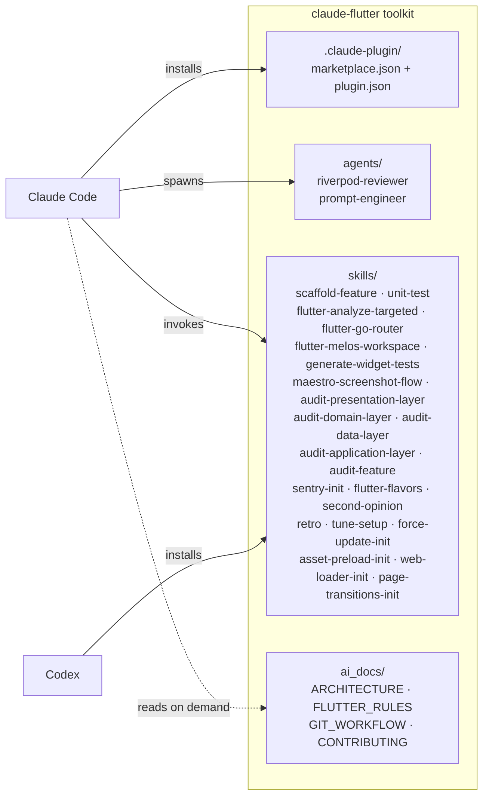

# Architecture

## What this repo is

A shared collection of agent skills and optional Claude Code subagents for Flutter/Dart projects using Riverpod v3, GoRouter, clean architecture, and Melos monorepo tooling.

This is a **toolkit repo** — the actual Flutter app lives elsewhere (e.g. `apps/tomcat_portal/`, `apps/pollicino_viewer/`). Application paths are relative to the Flutter project root. Bundled references and scripts resolve from the installed skill directory; sibling skills resolve through the host registry or sibling catalog layout.

## Repo structure

| Path | Purpose |
|---|---|
| `agents/` | Custom Claude Code subagent definitions (`.md` with frontmatter) |
| `skills/` | Shared skills invoked through the current host agent |
| `.codex-plugin/` | Native Codex manifest with the 21 active skill directories |
| `.agents/plugins/` | Native Codex marketplace pointing to this repository root |
| `.claude-plugin/` | Claude Code plugin manifest (`marketplace.json`, `plugin.json`) |
| `ai_docs/` | Architecture, rules, and contributor docs (loaded on demand) |

## Module diagram

```mermaid
flowchart LR
    subgraph Repo["claude-flutter toolkit"]
        plugin[".claude-plugin/\nmarketplace.json + plugin.json"]
        agents["agents/\nriverpod-reviewer\nprompt-engineer"]
        skills["skills/\nscaffold-feature · unit-test\nflutter-analyze-targeted · flutter-go-router\nflutter-melos-workspace · generate-widget-tests\nmaestro-screenshot-flow · audit-presentation-layer\naudit-domain-layer · audit-data-layer\naudit-application-layer · audit-feature\nsentry-init · flutter-flavors · second-opinion\nretro · tune-setup · force-update-init
asset-preload-init · web-loader-init · page-transitions-init"]
        aidocs["ai_docs/\nARCHITECTURE · FLUTTER_RULES\nGIT_WORKFLOW · CONTRIBUTING"]
    end

    cc[Claude Code]
    codex[Codex]
    codex -->|installs| skills

    cc -->|installs| plugin
    cc -->|invokes| skills
    cc -->|spawns| agents
    cc -.->|reads on demand| aidocs
```

## Key skills

| Skill | Trigger |
|---|---|
| `scaffold-feature` | "Starting a new feature" — Socratic intake, clean-arch directory scaffold, architecture contract, context seed |
| `flutter-analyze-targeted` | Fast `dart analyze` scoped to a feature path |
| `unit-test` | Generate/update/repair unit tests (mocktail, GWT, Riverpod ProviderContainer) |
| `generate-widget-tests` | Generate widget tests using Robot Testing pattern |
| `flutter-go-router` | Navigation: routes, guards, shell navigation, URL-driven state |
| `flutter-melos-workspace` | Melos monorepo orchestration |
| `maestro-screenshot-flow` | Maestro YAML for Android screenshots — id-based selectors (`Semantics(identifier:)`), immune to translation and UI refactors; edits app source to add missing identifiers; helper scripts for tree inspection and ADB reset |
| `audit-presentation-layer` | Rules-based static audit (Riverpod, Robot Testing, GoRouter, layout, responsive, assets, credential autofill, web affordances, web boot loader on app-root runs) — platform-aware (auto-detect / `--platform`) |
| `audit-domain-layer` | Rules-based static audit: infra imports in domain, untyped/non-sealed exceptions, entity serialization, hardcoded UI strings |
| `audit-data-layer` | Rules-based static audit: leaky abstractions, missing exception conversion, model mapper gaps, untyped datasource exceptions |
| `audit-application-layer` | Rules-based static audit: Flutter imports in application code, redundant try/catch in notifiers, mutation return types, unconstrained state types |
| `audit-feature` | Orchestrator: runs per-layer audits with permitted read-only subagents or sequential scans; aggregates into one report; presentation-only shortcut for sub-features |
| `sentry-init` | Bootstrap `sentry_flutter`: installs deps, patches `main.dart`, wires GoRouter observer, Riverpod error capture (LoggerService decorator or a scaffolded ErrorLogger sink), beforeSend/sampling policy, web BetterFeedback, release-upload checklist |
| `flutter-flavors` | Init dev/stg/prod flavors (flutter_flavorizr targeted processors, or manual fallback) across Android/iOS/Web + VSCode/Android Studio IDE config; detects an existing partial/broken setup and switches to an AUDIT+FIX branch against a bundled rule catalog; optional multi-project Firebase |
| `force-update-init` | Bootstrap `force_update_helper`: installs deps, patches `AndroidManifest.xml`, wires `ForceUpdateWidget` into `MaterialApp.builder`/GoRouter, sets up a remote `required_version` source (GitHub Gist, Firebase Remote Config, or a scaffolded Dart Shelf backend), handles non-store distribution (Firebase App Distribution, TestFlight, enterprise); or audits an existing setup against the two silent failure modes (missing `APP_STORE_ID`, missing Android `<queries>` intent) |
| `asset-preload-init` | Inventory assets by loader/cache, generate only the needed first-frame warm-up (SVG `loadBytes(null)` with error handling at creation; `precacheImage` for raster), report oversized/unused assets; AUDIT mode checks existing warm-ups against `ASSET-01..04` in `audit-presentation-layer` |
| `page-transitions-init` | Generate an adaptive `PageTransitionsTheme` (Android zoom / iOS Cupertino, instant on web/desktop), wire it into every light and dark theme, opt-in router migration off the `NoTransitionPage` helper; AUDIT mode maps to `ROUTER-03` in `audit-presentation-layer` |
| `web-loader-init` | Scaffold a Flutter web boot loader (overlay + staged progress bar, no Dart): patches `web/index.html`, writes `style.css` and an IIFE-wrapped `flutter_bootstrap.js` that removes the loader on `flutter-first-frame`, conditional `serviceWorkerSettings`; AUDIT mode checks an existing loader against `WEB-02` in `audit-presentation-layer` |
| `second-opinion` | Independent architecture review through Gemini, Codex, or Claude CLI |
| `retro` | End-of-task self-audit: reads session transcript for verifiable friction evidence (`scripts/session-evidence.{sh,ps1}`), answers 6 hard questions backed by it, persists learnings to authorized native memory with dedup, or retains them in the report, flags unintegrated git work, proposes fixes (generic, not Flutter-specific) |
| `tune-setup` | On-demand config & workflow audit: the current agent's instructions, settings, supported hooks and agents, and observable skill-trigger evidence, backed by `retro`'s script extended with an opt-in `--config-audit` flag; proposes config fixes, never runs automatically (generic, not Flutter-specific) |

## Agents

| Agent | Purpose |
|---|---|
| `riverpod-reviewer` | Reviews Riverpod v3 provider code — `ref.watch`/`ref.read` placement, `.select()` usage, v3 naming, `AsyncValue` handling |
| `prompt-engineer` | Designs, tests, and optimizes LLM prompts for production systems |

## Skill design: self-contained

All skills bundle their reference docs locally (e.g. `rules/`, `references/` subdirectories). No skill loads docs from the target project's `ai_toolkit/` at runtime — that dispatcher pattern has been retired. State in SKILL.md which reference subtree the skill uses.

This flat `skills/<name>/SKILL.md` layout doubles as the discovery contract for [skills.sh](https://www.skills.sh)'s `npx skills add` — no format changes needed to support both the Claude Code plugin marketplace and npx-based multi-agent distribution.

## Orchestrator skills

`audit-feature` is an **orchestrator**: it has no `rules/` of its own. Instead, it reads the
`CATALOG.md` from each per-layer skill at runtime and passes the catalog, scan instructions, and installed resource directory to permitted
read-only subagents — one per layer — or performs the same scans sequentially. The orchestrator resolves each installed layer skill and embeds its catalog in a self-contained scan prompt. Delegation is optional; the same scans run sequentially when it is unavailable or not permitted.

This is distinct from the old **dispatcher** pattern (which delegated to a central `ai_toolkit/`
doc tree). Orchestrators own the aggregation and fix logic; per-layer skills own the rules.

## Host-specific behavior

All skill entrypoints explain native-tool and resource resolution. Claude metadata stays in the existing frontmatter; Codex invocation/UI metadata lives in each skill's `agents/openai.yaml`. `tune-setup` and archived `build-filter` disable implicit invocation. The Codex manifest excludes `build-filter`; its text forbids executing the archived workflow if manually loaded elsewhere.

`retro/scripts/session-evidence.js` is the shared parser, with `codex-transcript.js` normalizing Codex rollout records. Codex config metrics that cannot be mapped to actual records are explicitly unavailable. `tune-setup` depends on the installed `retro` directory; it does not assume the target application contains this repository.

`audit-feature` depends on installed per-layer audit skills; widget provider patterns come from `unit-test`. Required dependencies must be installed together for full coverage. Missing dependencies cause explicit partial reports, not invented checks. Init skills' cross-links to audit catalogs are optional supporting references: their own bundled procedures remain usable, but missing audit coverage must be disclosed.

`second-opinion/scripts/review.js` uses standard Node.js APIs, supplies a prompt file through stdin, isolates provider cwd and disables mutating capabilities. Provider selection is explicit, defaulting to Gemini, with no automatic fallback on errors.
